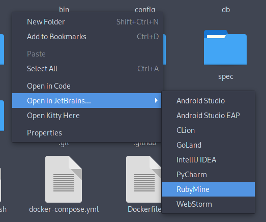

# jetbrains-nautilus

Adds context actions to launch files or directories in any installed product
from [JetBrains Toolbox](https://www.jetbrains.com/toolbox-app).

Finding manually-installed JetBrains products is currently unsupported, but PRs are welcome.



Inspired by & installation script from [code-nautilus](https://github.com/harry-cpp/code-nautilus).

## Automatic installation

Available in [Arch Linux AUR (jetbrains-nautilus-git)](https://aur.archlinux.org/packages/jetbrains-nautilus-git), otherwise:

```
wget -qO- https://raw.githubusercontent.com/encounter/jetbrains-nautilus/master/install.sh | bash
```

## Manual installation

- Ensure the package `python-nautilus` is installed.
    - (`nautilus-python` for yum-based distros)
- Copy `jetbrains-nautilus.py` from this repo to `~/.local/share/nautilus-python/extensions`.

## Uninstallation

```
rm ~/.local/share/nautilus-python/extensions/jetbrains-nautilus.py
```